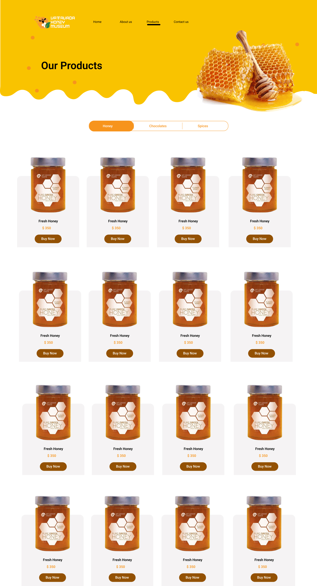

# Honey Museum Website

This document provides instructions on how to set up and work with the project, including guidelines for working with feature branches and setup branches.

## Table of Contents

- [Development Process](#development-process)
- [Design](#design)

## Development Process

To streamline the development process, follow these steps when working on your assigned feature branch:

1. **Checkout Your Assigned Feature Branch**

   You will be assigned a specific feature branch. To start working on it, checkout the branch:

   ```bash
   git checkout feature/your-assigned-branch
   ```

2. **Get the Latest Updates from `main`**

   Before making any changes, ensure your branch is up-to-date with the latest changes from `main`:

   ```bash
   git fetch origin
   git merge origin/main
   ```

3. **Make Changes**

   Implement the required changes or new features according to the task description. Make sure to test your changes locally to ensure everything works as expected.

4. **Commit Your Changes**

   After making and testing your changes, add them to the staging area and commit them with a descriptive message:

   ```bash
   git add .
   git commit -m "Describe your changes"
   ```

5. **Push Your Changes to Remote**

   Push your committed changes to the remote repository:

   ```bash
   git push origin feature/your-assigned-branch
   ```

6. **Create a Pull Request**

   Once your changes are pushed, go to the repository on GitHub and create a pull request (PR) from your feature branch to `main`.

   - Ensure that your PR description includes a summary of the changes made.
   - Request a review from relevant team members.
   - Wait for the PR to be reviewed and approved before merging it.

## Design

### Home Page


### Products Page


